# Coding-Quiz

Project Description &mdash; Timed multiple-choice coding quiz with high scores display.

## User Story

```
AS A coding boot camp student
I WANT to take a timed quiz on JavaScript fundamentals that stores high scores
SO THAT I can gauge my progress compared to my peers
```

## Acceptance Criteria

```
GIVEN I am taking a code quiz
WHEN I click the start button
THEN a timer starts and I am presented with a question
WHEN I answer a question
THEN I am presented with another question
WHEN I answer a question incorrectly
THEN time is subtracted from the clock
WHEN all questions are answered or the timer reaches 0
THEN the game is over
WHEN the game is over
THEN I can save my initials and my score
```

## Mock-Up

The following animation demonstrates the application functionality:

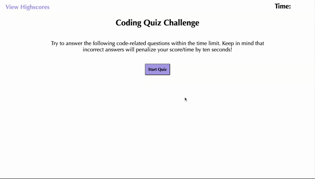

## Project Development Process

### HTML

The first step of this project was to first create the structure of the HTML. The HTML started off with the basics: the head, the body, and then the header, main, and various other sections within the body. The header contained the nav bar for the highscore viewing navigation, and h1 for the timer countdown. The main element was created to contain essentially the "homepage" seen when the site is first launched. This contains the title and then the description for what the challenge is. It then also contains the button for starting the quiz. 

After the main element, are the multiple div elements. Each one serves a specific purpose. The first one contains the actual questions, the question answer options in the form of buttons and the result based on which answer was selected by the user. Each element within this parent div had a unique id to be used in the Script file via DOM methods.

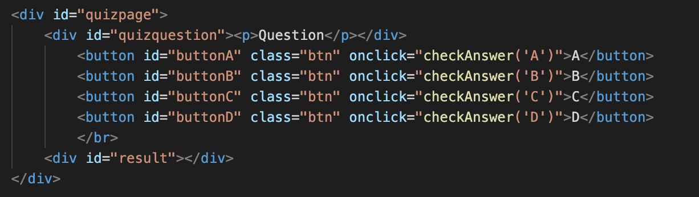

The next div element section contains the Game Over scoreboard page where the users score, and input field for their initials is displayed. Each element within this parent div also has unique id's to be referenced and manipulated in the script file.

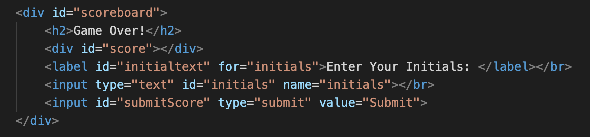

The final div element section is for the highscores page. Similarly to the other sections, this contains each of the highscore ranking which displays theusers score and initials. There are also two buttons to give the user the option to either play again or clear the highscores. 

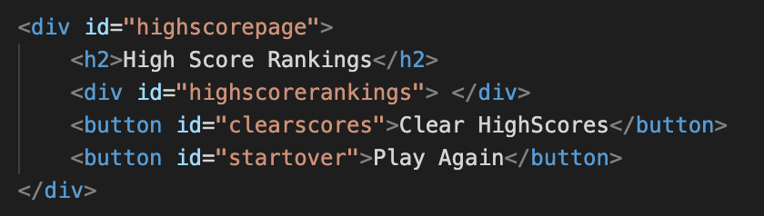

### Script

To start, query Selectors were used to create variables for each of the HTML elementss using their individual unique id names:

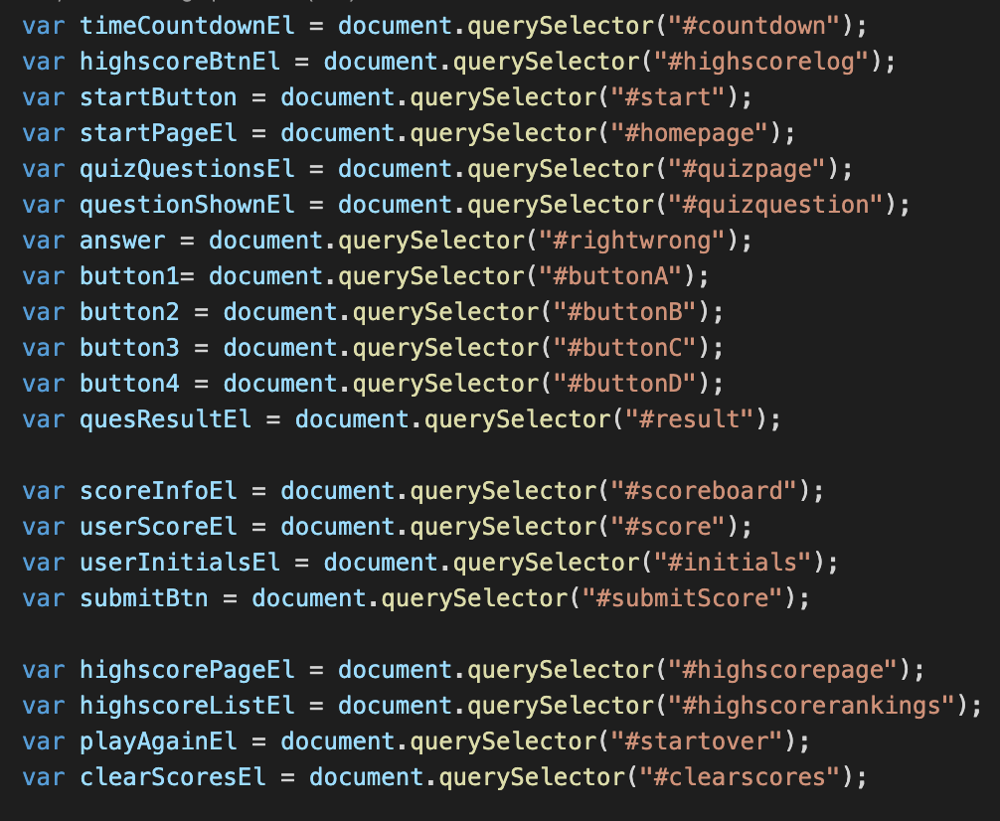

A function was then created for the timer countdown. In this application, we wanted the timer to countdown from 75 when the user clicks the "play" button. Additionally, each time the user answers a question wrong, we want the timer to subtract 10 seconds from the time, as well as subtract 1 from the score value. See below for a screenshot of the timer function, as well as the function for starting the quiz:

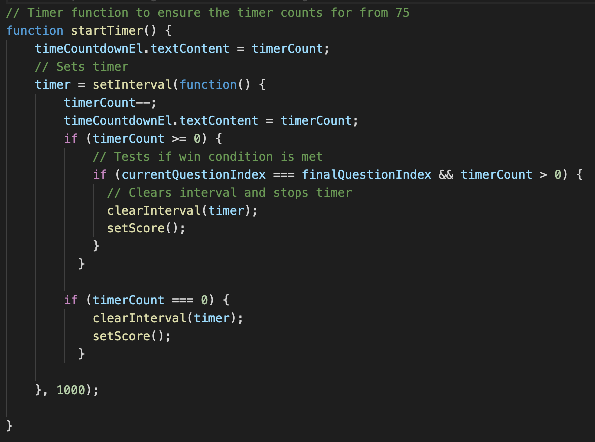

Notice how in the start quiz function below, we use the style.display method to hide the portions in the html that we dont want to show on the screen. This way, when the user clicks "play", the homepage screen is hidden and the question page screen is displayed. When looking back at the query selectors, this is done by using the variable we created to associate with the parent id of each of these sections.

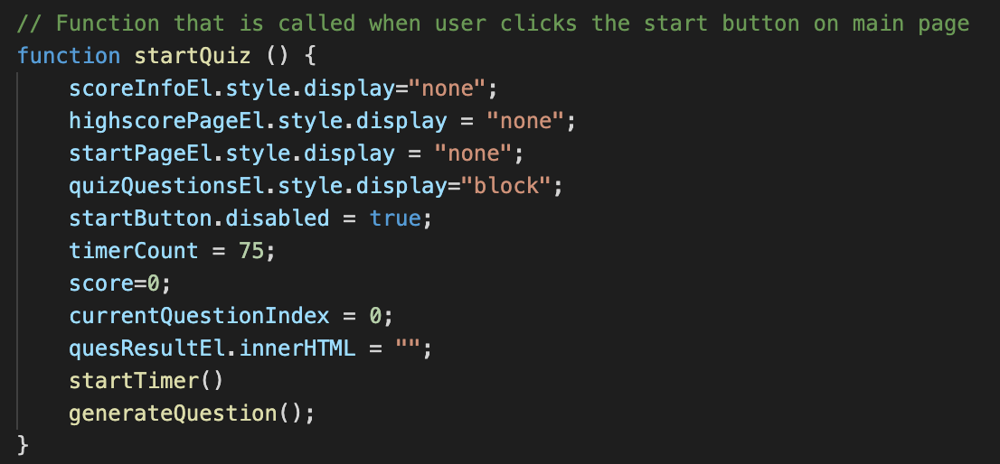

Now, before getting into the functions for actually generating the questions and checking the users answer, lets look at how the actual questions were structured:

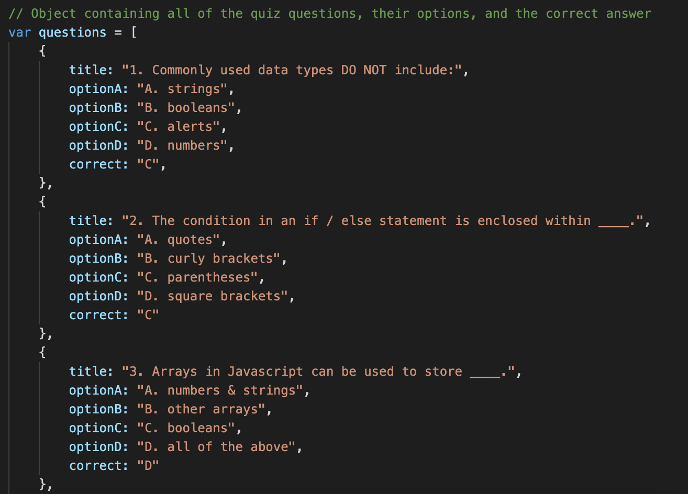

In this application, a questions array was created which contains objects for each question. Each object in the array is apecific to each question, with a property for the question itself, 4 properties for each of the options, and then a property for the correct answer. So in total, the questions array has 5 different objects within it.

We then use a function called generate Question to handle displaying the questions array based on the index of the array. Outside of this function we created two variables: one for the total length of the array, and one for the current index of the question being displayed. So, for example, if the user was on the second question, the current question index would be 1, and the final question index would be 5, so 1 is less than 5 so the question will display. Inner HTML is used as well to insert the question to the page. If the question index is greater than the finalquestion index, the set score function in called. See below for a visualization of this function:

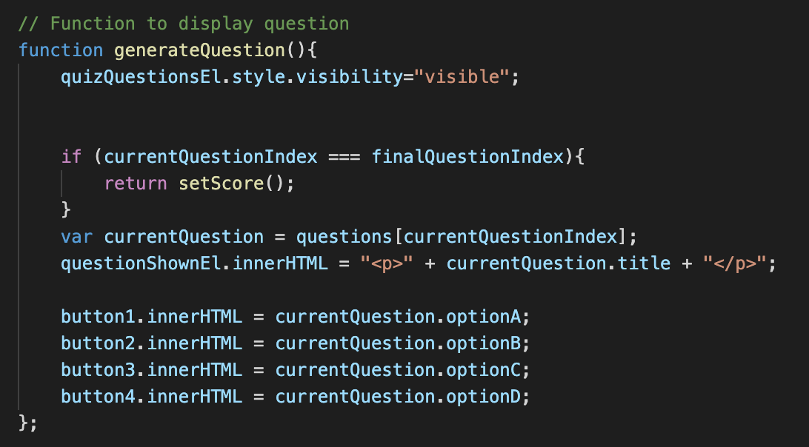

Once the question is displayed, we have a function for actually checking to see if the option the user selects is the correct one. Notice in the HTML, each button have a pointing device called out of "onclick" which calls the checkAnswer function and passes into the function the string of which option they selected (A, B, C or D). So, the check answer function compares this string letter to the answer property in the actual questions array for the specific question object at hand. If the answer is correct and the values match, the score increases, the question index increases by one, "That is correct" displays, and the generate question function is called which will move onto the next question since the question index was increased. If the answer is incorrect, the time decreases by 10, the score decreases by 1, "that is incorrect" displays, the question index increases by 1, and the generate question function is called. Lastly, if the question index is equal to the final question index, the set score function is called so that a new question isnt generated since there are no more questions to display. 

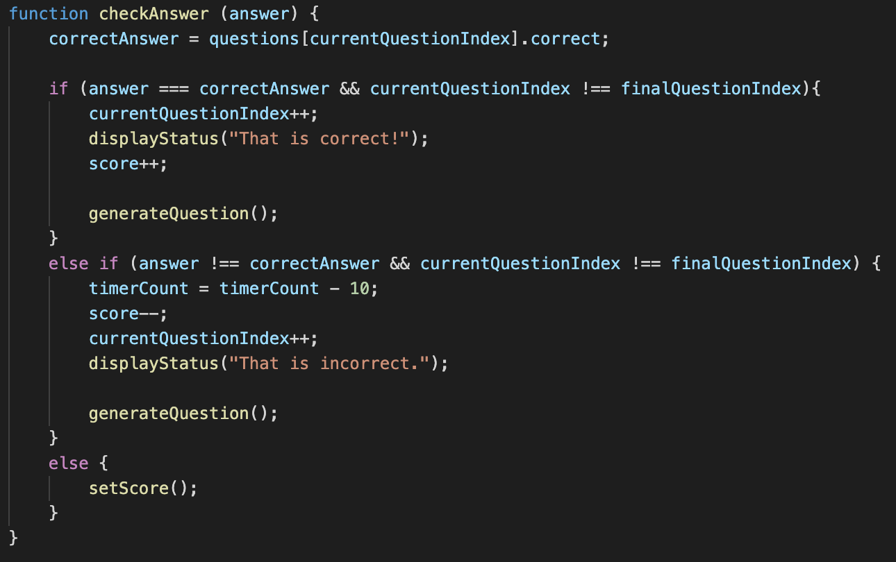

Note, that when the "That is incorrect" or "That is ocrrect" is displayed as described in the previous function, this is done by calling the display Status function and passing into it the string of whether the answer was right or wrong. Here we use setTimeout so that the status of the users answer is displayed for only 1.5 seconds and then disappears:

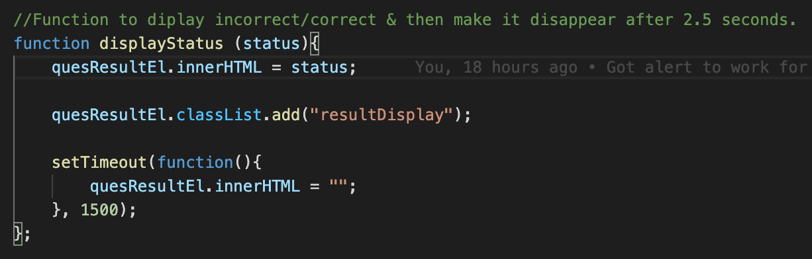

So, as mentioned previously, when the user answers a question correct or wrong, the score is adjusted and once they've completed all of the questions, the Game Over screen will appear. The set score function assists in displaying this screen and the user's score, as well as hiding the previous screens. Also, in this function, we store the user's score in local storage using the localStorage.setItem:

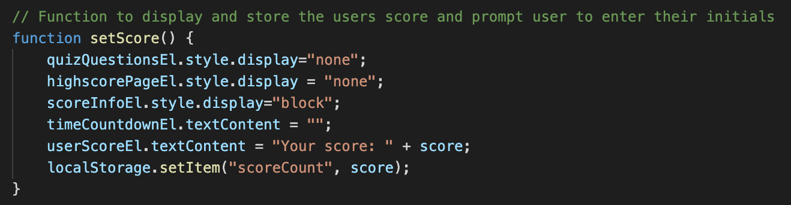

We then created an event listener with a function for when the user submits their initials at the end of the game when viewing their final score. An if/else statement is used so that if the user does not enter anything, an alert will pop up and alert them that they must enter their initials. If their initials are entered into the input, that value will be stored into the userInitialsEl variable which was created using the document.querySelectors mentioned earlier, and then set to the "user" variable. Now, in order to store all score history, we created an array of highscores. In this array, after each player submits their info, the string of "Initials: " + user + ", Score: " + score is pushed into that array. From here, we want to add this to the local storage. Once this is done, the get Highscores function is called to handle displaying the highscore rankings. See below for the event listener for the initials input field submit button and its structure:

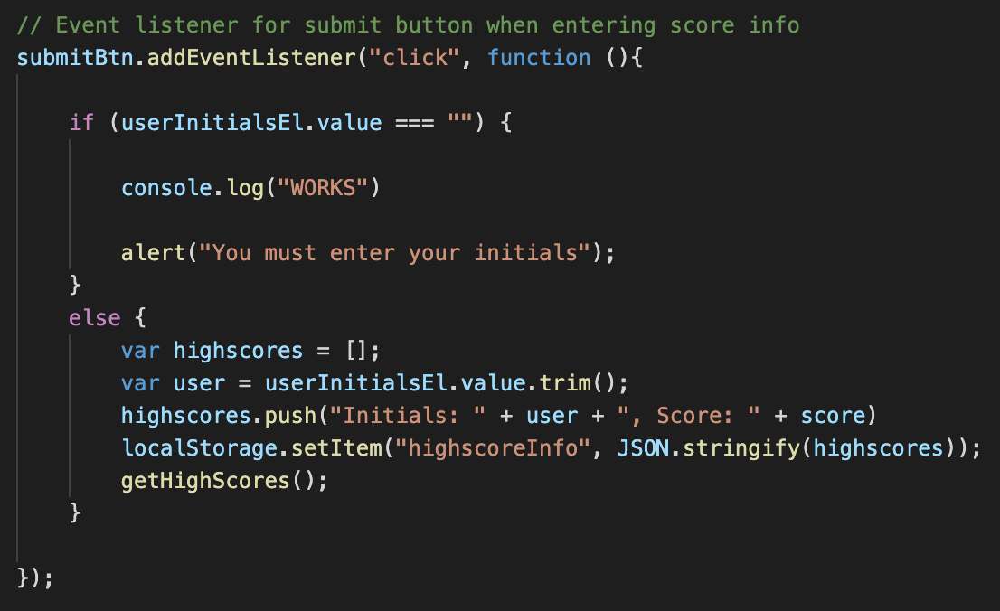

So now, once the user submits their information, they are taken to the highscore page. This is where all of the highscores are displayed. It was mentioned that an array of highscores was created to store each users information and score. In this function, we display the contents of each index of this array by using the createELement, append, and createTextNode methods. This allows us to insert an ul to the highscore page without changing the HTML itself. See below for the how this was done:

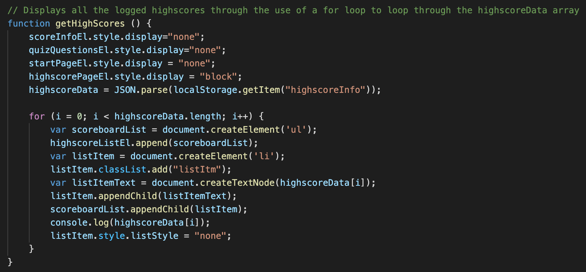

Within the highscore page itself, there are two buttons displayed which give the user the option to either clear the highscores or play again. To clear the scores, an event listener is used and within it, we set the innerHTML to an empty string and localStorage.clear() using a clearScores function within the event listener itself:

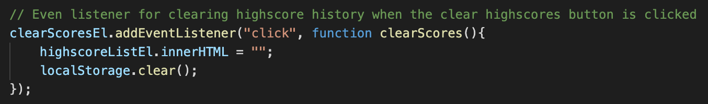

Below, you can also see the additional event listeners that were used to assist with controlling what happens when the user clicks certain buttons. For the play again button and start button, the same function is called. For the View Highscores nav link at the top of the page, the event listener is used to display the highscore page.

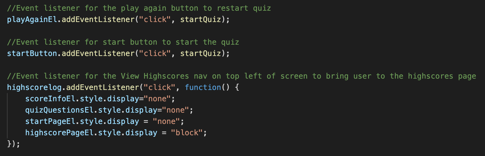

## Credits

MDN Web Docs - [Document.querySelector](https://developer.mozilla.org/en-US/docs/Web/API/Document/querySelectorAll)

MDN Web Docs - [Working with Objects](https://developer.mozilla.org/en-US/docs/Web/JavaScript/Guide/Working_with_Objects)

W3Shools - [JavaScript DOM Event Listeners](https://www.w3schools.com/js/js_htmldom_eventlistener.asp)

W3Schools - [Style Visibility Property](https://www.w3schools.com/jsref/prop_style_visibility.asp)

W3Schools - [Web APIs](https://www.w3schools.com/js/js_api_intro.asp)

W3Schools - [Window setTimout Method](https://www.w3schools.com/jsref/met_win_settimeout.asp)

W3Schools - [HTML Web Storage API](https://www.w3schools.com/html/html5_webstorage.asp)

Free Code Camp - [JavaScript Timers](https://www.freecodecamp.org/news/javascript-timers-everything-you-need-to-know-5f31eaa37162/)

Lastly, the style.css sheet was created just to give the page a better looking layout. 

## Links

GitHub Repository - [Code-Quiz Repository](https://github.com/ktrudickm/Coding-Quiz "Coding Quiz Repository")

Deployed Project - [Deployed Application](https://ktrudickm.github.io/Coding-Quiz/ "Deployed Application")